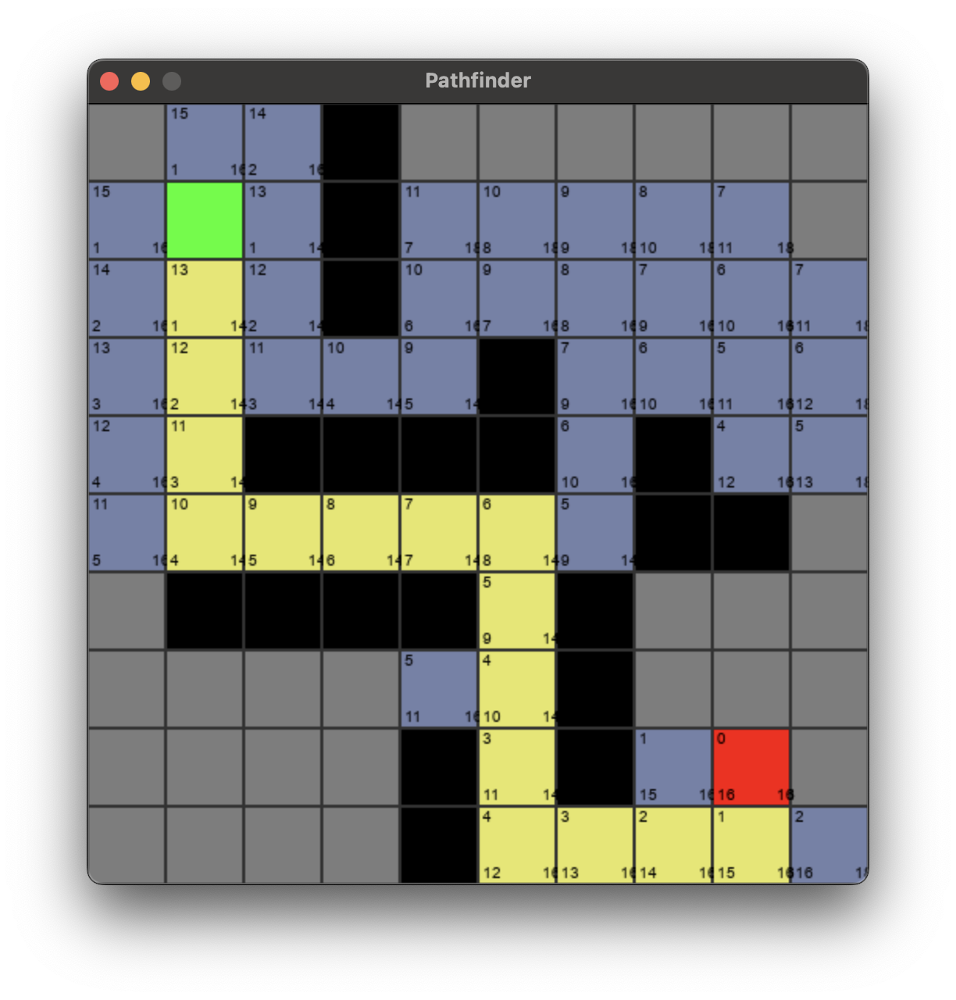

# Pathfinder

A demonstration of the A* pathfinding algorithm



## Usage

```shell
poetry install
poetry shell
python pathfinder.py
```

## Controls

* Click to place start tile
* Click to place finish tile
* Click to toggle walls
* `Space` Solve
* `Escape` Reset
* `Alt-Click` Toggle tile colour
* `Shift-Click` Toggle tile text
* `S` Save map Use terminal to enter filename (must have .map extension)
* `L` Load map - Use terminal to choose map
